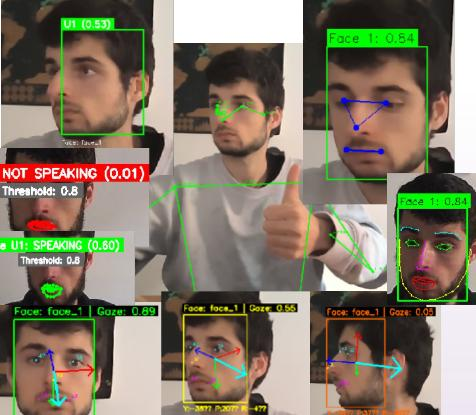

# EutHRIFaces: Face Detection, Recognition, Gaze Estimation, and Visual Speech Activity for Human-Robot Interaction 
[](https://github.com/Eurecat/EutHRIFaces/actions/workflows/ci-cd.yml)

[](https://github.com/Eurecat/EutHRIFaces/actions/workflows/ci-cd.yml)
[](https://github.com/Eurecat/EutHRIFaces/actions/workflows/ci-cd.yml)

🚀 Production-ready ROS2 (Jazzy, Humble-WIP) face perception stack with **advanced YOLO detection** 🎯 and a **custom persistent identity manager** 🆔. Uniquely integrates **MongoDB** 💾 for real-time user tracking with automatic re-identification across sessions—identities survive Docker restarts! Fully compliant with the [ros4hri](https://github.com/ros4hri) 🤖 standard, leveraging state-of-the-art open-source AI models in an enterprise-grade architecture.

## 🏗️ Architecture Overview and RVIZ Visualization

<table>
  <tr>
    <td align="center" width="50%">
      
    </td>
    <td align="center" width="50%">
      
    </td>
  </tr>
  <tr>
    <td align="center"><em>Perception Stack Architecture</em></td>
    <td align="center"><em>RVIZ Visualization Output</em></td>
  </tr>
</table>

**EutHRIFaces** is part of the Visual Perception Domain and focuses specifically on face-related processing.


### Key Characteristics

- **Standalone & Independent**: This repository contains self-contained ROS2 packages that work independently
- **Simple Input Requirements**: Only requires a camera image stream (e.g., `/camera/image_raw/compressed`)
- **ROS4HRI Standard**: Publishes all outputs following the [ROS4HRI standard](https://github.com/ros4hri)
- **Message Definitions**: The `hri_msgs` package is included in the `Docker/deps/` folder
- **Docker Architecture**: Each ROS2 package runs in its own container, all built from the same base image for consistency&optimization

### Integration Example

```bash
# Any camera publisher (e.g., from EutEntityDetection/eut_utils)
/camera/image_raw/compressed  →  [EutHRIFaces]  →  ROS4HRI topics
                                                   ├─ /humans/faces/tracked (with ros4hri_with_id)
                                                   ├─ /humans/faces/detected  (default: optimized)
                                                   ├─ /humans/faces/gaze
                                                   ├─ /humans/faces/speaking
                                                   └─ /humans/faces/recognized
                                                   
```

**Note on Topic Names:**
- **Default mode** (optimized): Topics without individual IDs (e.g., `/humans/faces/detected`)
- **With ID mode** (ros4hri_with_id): Topics include face IDs (e.g., `/humans/faces/{face_id}/detected`)
- The ID mode provides full ROS4HRI compliance but with slightly higher overhead. Enable it via launch parameter `ros4hri_with_id:=true`

Once you have a camera publishing images, EutHRIFaces packages will automatically detect, recognize, and analyze faces, publishing standardized HRI data for downstream multimodal fusion (e.g., EutPersonManager).

---

## 📦 Packages

This repository contains four main packages:

### 1. face_detection 🔍

YOLO-based face detection with 5 key facial landmarks.

- **Input**: RGB camera images
- **Output**: `hri_msgs/FacialLandmarksArray` (ros4hri compatible)
- **Features**: 
  - Auto-download YOLO face model (and optionally mediapipe and dlip models)
  - CPU/GPU support
  - Real-time performance
  - 5 key landmarks (eyes, nose, mouth corners)

[➡️ See face_detection README](face_detection/README.md)

### 2. face_recognition 👤
Face recognition and identification capabilities.

- **Planned Features**:
  - Face embedding extraction
  - Identity management
  - Face matching and verification
  - Database integration

### 3. gaze_estimation 👁️
Gaze direction estimation from facial landmarks.

- **Planned Features**:
  - Head pose estimation
  - Eye gaze direction
  - Point of attention estimation
  - 3D gaze vectors

### 4. visual_speech_activity 👄
Visual speech activity detection from lip movements.

- **Planned Features**:
  - Lip movement detection
  - Visual speech activity detection (VAD)
  - Speaking/non-speaking classification
  - Multimodal fusion support

---

## 🚀 Quick Start

## Installation & Setup

#### 0. Build Base Image

First, build the desired base Docker image from [EutRobAIDockers](https://github.com/Eurecat/EutRobAIDockers)

#### 1. Clone This Repository

```bash
git clone git@github.com:Eurecat/EutHRIFaces.git
cd EutHRIFaces
```

#### 2. Build the application image

   ```bash
   cd Docker && ./build_container.sh --vulcanexus
   ```
   Please note that:
    * your default ssh keys will be used to build the image
    * you might need to be within Eurecat VPN to pull dependencies from our private gitlab through vcs. 
   
   You can use `--clean-rebuild` to force a clean rebuild from scratch (i.e. no cached layers).

## 🐳 Launch

### Option A: Deployment (Docker Compose)

As simple as...
   ```bash
   docker compose up
   # Expecting camera input on /camera/image_raw/compressed 
   # Use https://github.com/christianrauch/camera_ros to publish camera images if needed
   # or use our EutEntityDetection package to publish both camera and entity detection results if public already
   ```
... within `Docker/` folder

**Architecture:** Each ROS2 package (face_detection, face_recognition, gaze_estimation, visual_speech_activity) runs in its own dedicated container. All containers are built from the same base image, ensuring consistency while allowing independent scaling and resource management.

This will start all face processing modules. If you want to run only specific modules, you can scale down the services you don't need:

   ```bash
   # Run only face detection
   docker compose up --scale eut_face_detection=0
   
   # Run only face detection and gaze estimation
   docker compose up --scale eut_face_detection=0 --scale eut_gaze_estimation=0
   
   # Run only face detection and face recognition
   docker compose up --scale eut_face_detection=0 --scale eut_face_recognition=0

   ```

### Option B: DevContainer (Development)

Within VS Code editor, make sure you have installed extension DevContainer, press `ctrl+shit+P` (command option) and search for "_Dev Containers: Open Folder in Container..._". From there you can select the folder Docker/DevContainer and the stack will launch in development mode (no node will be automatically started).

### Notes
Please note that launching the stack might involve launch of GUI application from docker, therefore make sure in the current active session in the host you have given at least once the following command to make sure permissions are given.

```bash
xhost +local:docker
```

### Usage
In terminal inside the docker:

#### Face Detection
```bash
# Launch face detection node
ros2 launch face_detection face_detection.launch.py

# With custom camera topic
ros2 launch face_detection face_detection.launch.py input_topic:=/your/camera/topic
```

#### Face Recognition
```bash
# Launch face recognition node
ros2 launch face_recognition face_recognition.launch.py
```

#### Gaze Estimation
```bash
# Launch gaze estimation node
ros2 launch gaze_estimation gaze_estimation.launch.py
```

## Docker Support

The repository includes Docker support in the `Docker/` directory for easy deployment and development.

## ROS4HRI Compatibility

All packages follow the [ros4hri](https://github.com/ros4hri) standard for human perception in robotics:

- Uses standard `hri_msgs` message definitions
- Compatible with other ros4hri packages
- Follows established conventions for human tracking and identification

## Architecture

```
EutHRIFaces/
├── face_detection/     # YOLO face detection + mediapipe + dlip (IMPLEMENTED)
├── face_recognition/   # Face identification (TODO)
├── gaze_estimation/    # Gaze direction (TODO)
└── Docker/            # Docker deployment files
```

## Dependencies

- **hri_msgs**: ROS4HRI message definitions
- **cv_bridge**: OpenCV-ROS bridge
- **sensor_msgs**: Standard sensor messages
- **std_msgs**: Standard message types

## Contributing

1. Fork the repository
2. Create a feature branch
3. Make your changes
4. Submit a pull request


### Managing the Speaker Recognition Database

To query the database:
```bash
mongosh
use face_recognition_db
db.identity_database.find()
```

To delete the database, remove the associated Docker volume.

You can also manage entries via the web interface at [http://0.0.0.0:8081/db/face_recognition_db/identity_database/](http://0.0.0.0:8081/db/face_recognition_db/identity_database/).


## Troubleshooting

## Troubleshooting

### Port 27018 Already in Use

If you encounter the error `failed to bind host port for 0.0.0.0:27018:172.21.0.2:27018/tcp: address already in use`, this means another service is already occupying port 27018. The docker-compose MongoDB service cannot start because the port is blocked. To resolve this, identify and stop the conflicting service with `sudo lsof -i :27018` and kill the process if needed, then restart docker-compose. 

```bash
sudo lsof -ti:27018 | xargs -r sudo kill -9
```
### Container Name Conflicts

If you switch between `dev-docker-compose.yaml` and `docker-compose.yaml`, you may encounter errors like `Conflict. The container name "/mongodb_faces" is already in use`. This happens because containers from the previous compose file are still running. To resolve this, remove all containers and restart: 
```bash
docker rm -f $(docker ps -aq)
```
then run `docker compose up` again. This cleanly removes all existing containers and allows the new composition to start fresh.

## License

Apache-2.0

## Maintainer
[Josep Bravo](https://github.com/LeBrav)

## Related Packages

- [EutHRIHumanBody](../EutHRIHumanBody): Skeleton and pose detection
- [EutEntityDetection](../EutEntityDetection): General object detection
- [eut_yolo](../eut_yolo): Advanced YOLO-based perception pipeline
